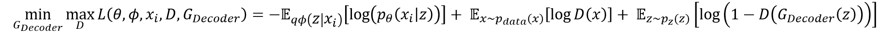
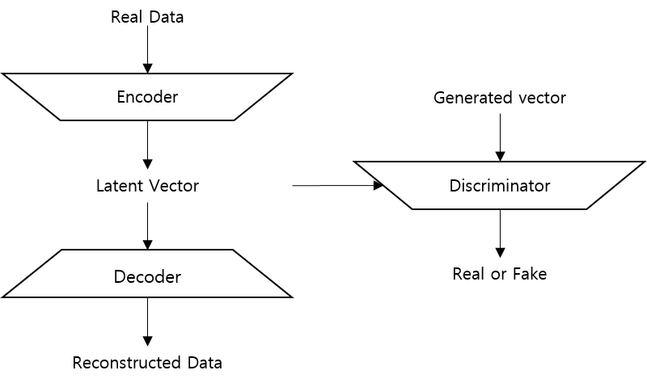

## AAE(Adversarial AutoEncoder)
Incompleted code...

### English
AAE is the model that graft GAN onto AutoEncoder.
Traditional AutoEncoder is composed of a Encoder and a Decoder, but AAE has a Discriminator seen in GAN. 
This characteristic is the intention for solving the weakness of traditional VAE. 
Explict generative model like VAE assume the distribution when the model training. 
However, there is a possibility that VAE will not be able to learn properly if the distribution doesn't fit with data. 
So, AAE train features of data without prior distribution using the characteristic of implict generative model such as GAN.
In this process, Discriminator in AAE decrease the difference of distribution between real data and reconstruction data created by Decoder. 

 

### Korean
AAE는 AutoEncoder에 GAN의 컨셉을 접목시킨 모델이다. 
기존에 AutoEncoder는 Encoder, Decoder로 이루어져 있는 반면, AAE에는 GAN에서 볼 수 있었던 Discriminator가 붙어있다. 
이는 기존 VAE의 단점을 해결하기 위함으로 VAE와 같은 명시적 생성 모델은 학습할 때 데이터의 분포를 가정하고 시작한다. 
하지만 학습되는 데이터가 가정한 분포에 맞지 않는 경우 VAE가 데이터를 제대로 학습하지 못할 가능성이 있다. 
따라서 GAN과 같은 암시적 생성 모델의 특성을 이용하여 AE에 접목해 학습 데이터를 가정하지 않고 데이터의 특성을 학습한다. 
이 과정에서 AAE의 Discriminator가 실제 데이터의 분포와 Decoder에서 생성되는 데이터의 분포의 차이를 줄여주는 역할을 한다. 

