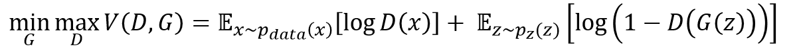
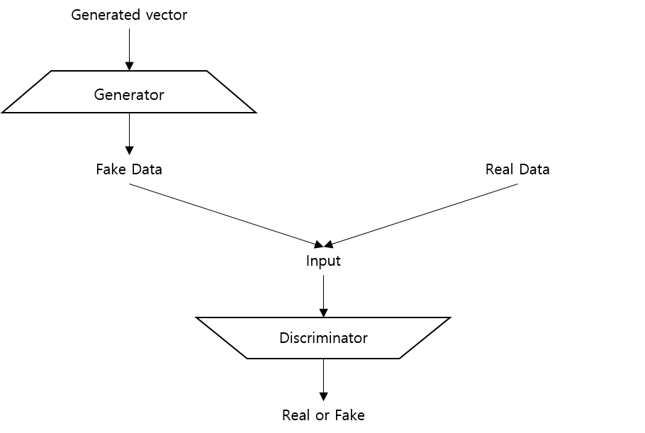

## GAN(Generative Adversarial Network)

### English
GAN is a Generative model that composed of Generator and Discriminator. 
In GAN, Generator and Discriminator compete each other. 
Generator deceive Discriminator that fake data be decided real data at Discriminator. 
And Discriminator separate betwenn real data and fake data. 
 
 

### Korean
GAN은 Generator와 Discriminator로 구성된 생성 모델이다. 
GAN에서 Generator와 Discriminator는 서로 경쟁하는 모델인데, 
Generator는 가짜 데이터를 만들어 Discriminator가 원본 데이터라 판단하도록 속이려하고, 
Discriminator는 원본 데이터와 가짜 데이터를 구분하려고 한다. 
수식은 다음과 같다. 아래 수식에서 G는 Generator, D는 Discriminator, x는 원본 데이터, z는 noise이다.
여기서 G를 최소화 하고, D를 최대화하는데, 이는 D(x)를 최대화해 x를 잘 구분하게 하고, G(z)를 최소화해 D로 하여금 G가 만들어낸 값을 제대로 구분하지 못하게 하기 위한 것이다.
 
